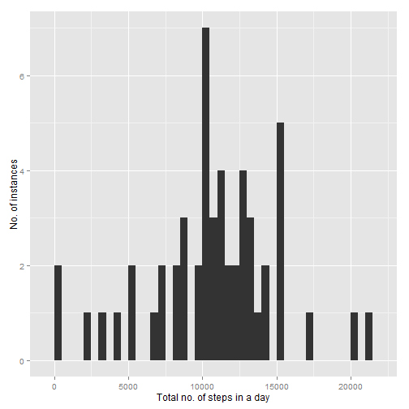
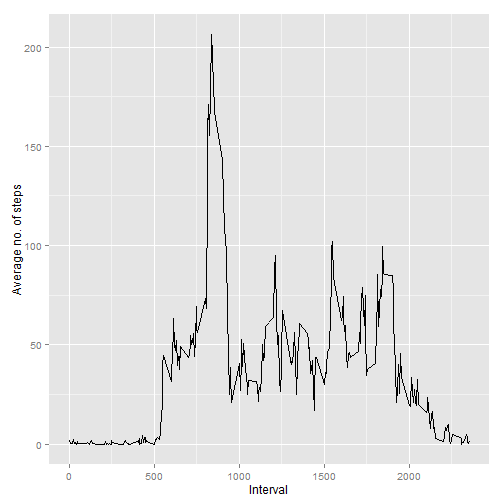
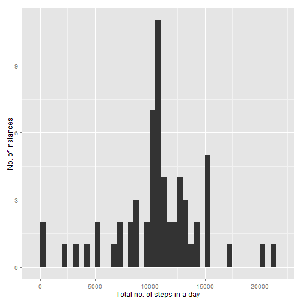
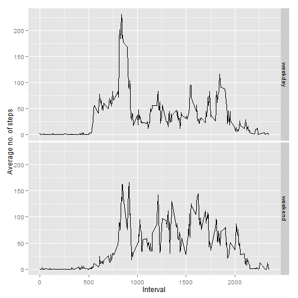

Reproducible Research: Peer Assessment 1
==========================================================


Hello there! Hope you're having fun with the course.

If it's ok with you, we'll now proceed with the assignment.

To begin with, we'll globally set the echo option to be true. This'll save us a lot of trouble in times to come.


```r
library(knitr)
opts_chunk$set(echo=TRUE)
```


###Loading and preprocessing the data

The first part's about loading the data. Easily done, assuming the data file's present in your working directory. Here's the code you ordered:


```r
activity_data <- read.csv("activity.csv", header = T)
```


###What is mean total number of steps taken per day?

Next, we need plot a histogram of the total no. of steps taken each day. As you know, a histogram depicts the frequency distribution of a set of data points. In this case, the data points are the total no. of steps taken per day.

This means the problem to be dealt with in two parts:

    1. Summarize the data to find the total no. of steps taken for each day
    2. Plot the frequency for each value of total no. of steps

First, we deal with part (1) through the following code:


```r
library(plyr)
activity_data_summary <- ddply(activity_data,.(date),summarize,total_steps=sum(steps))
```

Then we take the summarized data above and plot the corresponding histogram:


```r
library(ggplot2)
ggplot(activity_data_summary,aes(x=total_steps))+geom_histogram(binwidth=500) + xlab("Total no. of steps in a day") + ylab("No. of instances")
```

 


We calculate the mean and the median:


```r
mean <- format(mean(activity_data_summary$total_steps, na.rm = T), digits=2)
median <- format(median(activity_data_summary$total_steps, na.rm = T), digits=2)
```

That done, we can now say that the mean no. of steps / day is **10766** and the median no. of steps / day is **10765**.


###What is the average daily activity pattern?

Moving on to the next part, we need to plot the average no. of steps for every 5 min interval. For this, we first calculate the average no. of steps per interval:


```r
library(plyr)
activity_data_average <- ddply(activity_data,.(interval),summarize,avg_steps=mean(steps, na.rm=T))
```

And we plot the fruit of our labour:


```r
library(ggplot2)
ggplot(activity_data_average,aes(x = interval,y=avg_steps))+ geom_line()+xlab("Interval")+ylab("Average no. of steps")
```

 

Also, we find the interval with the maximum no. of steps:


```r
max_interval <- activity_data_average[which.max(activity_data_average$avg_steps),1]
```

So the interval with the maximum no. of steps on an average is **835**.


###Imputing missing values

Moving on, we now need the total no. of rows with missing data. This can be found through the complete.cases function:


```r
missing_value_rows <- sum(!complete.cases(activity_data))
```

The total no. of rows with missing data is **2304**.

For the second part, we'll replace the missing values with the average for the interval in a new data set. This can be done through a small 'for' loop:


```r
new_activity_data <- activity_data        ## create new data frame

for (i in 1:nrow(new_activity_data)) {
    if (is.na(new_activity_data[i,1])){
        
        interval <- new_activity_data[i,3]    ## note interval with missing data
        
        new_activity_data[i,1] <- activity_data_average[activity_data_average$interval==interval,2]  ## replace missing data with average for interval
    
        }
}
```

As before, we summarize the new data:


```r
library(plyr)
new_activity_data_summary <- ddply(new_activity_data,.(date),summarize,total_steps=sum(steps))
```

We take the summarized data and plot the new histogram:


```r
library(ggplot2)
ggplot(new_activity_data_summary,aes(x=total_steps))+geom_histogram(binwidth=500) + xlab("Total no. of steps in a day") + ylab("No. of instances")
```

 

Also, we calculate the mean and the median:


```r
new_mean <- format(mean(new_activity_data_summary$total_steps), digits=2)
new_median <- format(median(new_activity_data_summary$total_steps), digits=2)
```

The mean no. of steps / day is now **10766** while the median no. of steps / day is **10766**.

We can see that the mean remains the same, while the median goes up as compared to the first part.

Given that missing values have now been replaced with positive values, the total no. of steps / day is bound to increase. This is reflected in the scaling up of the y-axis in the new histogram as compared to the last one.


###Are there differences in activity patterns between weekdays and weekends?

Interesting question. Let's find out.

As per sensei's instructions, we'll create a factor variable in the dataset with two levels - "weekday" and "weekend". For this, we convert the date values from factors to POSIX and then run a small for loop:


```r
new_activity_data$day <- weekdays(as.POSIXct(new_activity_data$date))
for (i in 1:nrow(new_activity_data)) {
    if (new_activity_data$day[i]=="Saturday"|new_activity_data$day[i]=="Sunday") {
        new_activity_data$day[i]="weekend"
    }
    else {new_activity_data$day[i]="weekday"}    
}
```

We then calculate the average no. of steps per interval for each date. But this time, we also distinguish between weekdays and weekends:


```r
library(plyr)
new_activity_data_average <- ddply(new_activity_data,.(interval,day),summarize, avg_steps=mean(steps))
```

Finally, we make the panel plot:


```r
library(ggplot2)
ggplot(new_activity_data_average,aes(x = interval,y=avg_steps))+ geom_line()+xlab("Interval")+ylab("Average no. of steps")+facet_grid(day~.)
```

 

And there you have it. Applying my brilliant powers of deduction, I conclude that our guy / girl here walks to office on weekdays and works out on weekends.

So that's all for now. I look forward to your feedback. I try and respond positively to criticism, so please drop any fears of hurting my feelings and hold nothing back.

Cheers!
